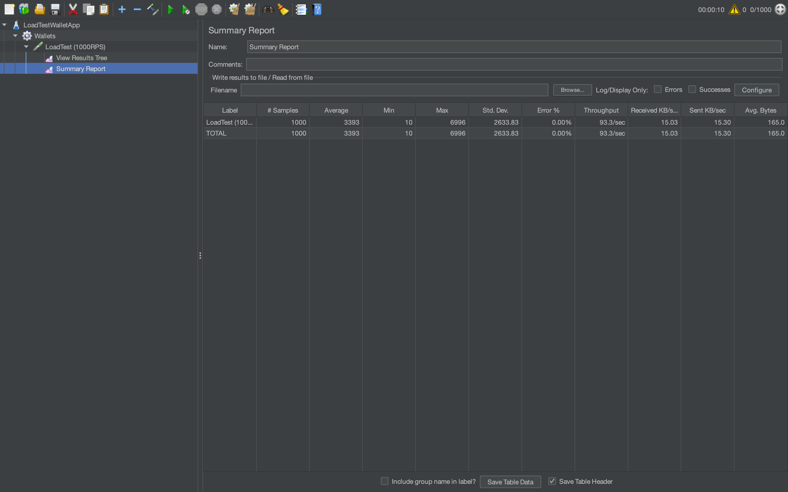

## О задании

Мини-приложение по пополнению баланса кошелька и его получению. 

Приложение содержит 2 части - сервис логики и сервис базы данных. 
Сервисы логики и базы данных поднимаются через *docker-compose* в 2 отдельных контейнерах.

*Стек технологий:* Java 17, Spring Boot 3, Spring Data JPA, Lombok, JUnit, Mockito, Postman,
REST, PostgreSQL, Liquibase, Docker, Apache JMeter.


## Функциональность

* **POST api/v1/wallet** - позволяет пополнить баланс кошелька;

* **GET api/v1/wallets/{id}** - позволяет получить баланс кошелька по id.


## Запуск приложения

Приложение поднимается через docker-compose, одновременно поднимая 1 инстанс PostgreSQL,
а также 1 сервис логики.

**Порядок запуска приложения:**
1. *Клонирование репозитория*
```
git clone https://github.com/MaxGoodfella/Java_Code_TA.git
cd Java_Code_TA
```

2. *Запуск контейнеров используя Makefile*
```
make restart
```
Это действие поднимет 2 контейнера, пересоберёт проект с помощью Maven.
Для перезапуска в дальнейшем можно смело использовать напрямую без отдельного ``` docker-compose down ```.

3. *Запуск коллекции запросов*

Коллекция postman-запросов доступна в папке postman. 

4. *Нагрузочное тестирование*

